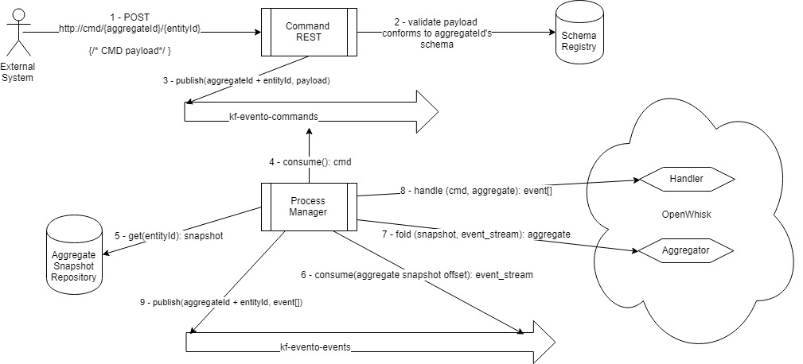

# Evento
Evento is an Event Sourcing platform based on Domain Driven Design (DDD) concepts. It provides Command Query Responsibility Segregation (CQRS) semantics over a Function-as-a-Service (FaaS) architecture. 


Component iteraction for handling an externally generated command.

## Entity
An Entity is a class of business objects. Its instances have constant identity and Value Objects that change over time. Entity instances must conform to a user-defined schema and are fully managed by Evento.

In a banking application, for example, Checking and Savings accounts could be defined as entities, and transactions would be their Value Objects. 

## Aggregate
An instance of an Entity always belongs to exactly one aggregate of entities. Each aggregate has exactly one **Aggregate Root**, a special type of entity that as its name implies, is the root of the Aggregate of entities. 

In that same banking application, CheckingAccount and SavingsAccount would be Aggregate Roots. A CreditAccount would be another, more interesting type of aggregate root, as it could have multiple instances of CreditCard entities belonging to the same aggregate. 

Client could be defined as another Aggregate Root. CheckingAccount, CreditAccount and SavingsAccount would have remote references to Client and react to events emitted by that aggregate. 


## Event
A core primitive in Evento is the Event itself. And Event represents something that happened to an Entity in the system. It is final and is usually named with verbs in the past tense: ```DepositReceived```, ```CashWithdrawn```, etc. The Event structure is fixed and acts as the envelope for a payload that comforms to a user-defined schema. The payload schema depends on the type of the event. i.e.:

```javascript
{ //this is not the actual event structure, just a simplified example
  entity: 'savings:12345-09',
  event_type: 'DepositReceived', 
  payload: {
    transaction_id: 123456789,
    source: 'checking:54321-90',
    amount: 100.00
  }
}
```

Events are published externally (see [REST API](#rest-api)) or by a Function (see [Functions](#functions)) and are available for all Functions and external applications to consume. 

Events can be consumed externally by listening to the Kafka topic named kf-evento-events.

## Command
Another core primitive in Evento is the Command. A Command describes the intent to perform an action. Commands are defined in imperative mood ```ReceiveDeposit```, ```WithdrawCash```, etc. The execution of the command may succeed or fail for business reasons. In either case an Event should be emitted to communicate the result. i.e: ```WithdrawCash``` would fail if the amount requested is not available, the account is closed, etc. 

Commands are immutable and Evento will retry the execution of a Command that fails without an Event. 

A Command has a specific target Entity. Only the function responsible for handling entities within the aggregate of the target entity will handle the command (more about that in [Functions](#functions)). 

Similar to an Event, a Command also acts like an envelope to the custom payload to be computed:

```javascript
{
  entity: 'checking:6789-21',
  command_type: 'WithdrawCash', 
  payload: {
    destination: 'atm:2CF24DBA',
    amount: 100.00
  }
}
```

## Functions
Evento is composed by different types of user-defined Funtions.

### Aggregator
Aggregators are responsible for building the Aggregate, a core functionality in Event Sourcing. They take in an initial version of an Aggregate--which may be empty or a previous snapshot--and an ordered stream of Events. They apply those events to the Aggregate and output its resulting state.

Evento uses Aggregators to construct the latest snapshot of each Aggregate and stores them into an object store for quick retrieval.

### Dispatcher
Dispatchers take an **Event** and respond with zero or many **Commands**. They act as filters, effectively accepting or rejecting work to be done in the aggregate. 

Dispatchers are not bound to any specific aggregate and there is room in Evento for generic, rule-based dispatchers. A BPEL engine, for example, could be implemented as a generic rule-based dispatcher.

### Handler
Handlers are called with a Command and the latest copy of the Aggregate in which the command should be performed. They respond with one to many Events. 

## Persistence
Persistence is entirely handled by Evento, and in its basic usecase, functions don't have to worry about reading or writing any data. Handlers are given the latest aggregate and respond with events. Aggregators are given the latest aggregate and the newly created events, then respond with the updated aggregate. This cycle ensures the aggregate is always updated and available for consumption.

## Schema
All entities and value objects within an aggregate, as well as all the events it can emmit and commands it can handle are defined as different data types in the same avro schema. Their namespace is the Aggregate name.

## REST API
Evento is a retro feeding system in which Events cause Commands and Commands cause Events (and maybe events cause events if we include sensors). To initiate a processing pipeline, Evento has a REST API through which external applications can publish Events or dispatch Commands.

## Cause
Events and Commands have a **cause**. Every Event emitted in response to a Command will have the Command as its cause. And every Command dispatched in reaction to an Event will have that Event as its cause. With that, any given Event or Command can be traced all the way back to its root external cause. 
